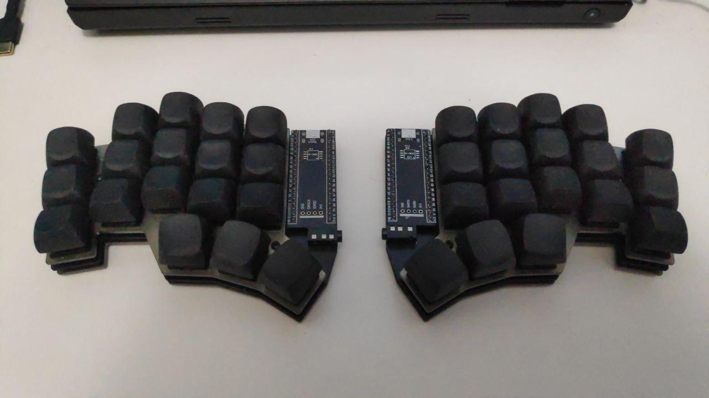
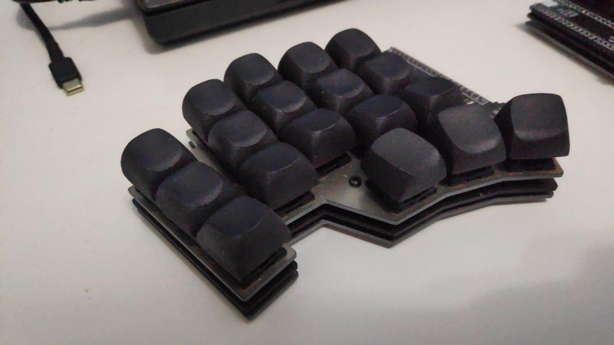

# Tenax

Tenax is a direct pin/diodeless split keyboard, based on the Blackpill dev board. with pinkie splay.

## Pictures

## Features

- No diodes
- Simple
  - No rgb
  - No oled
  - No buzzer (why someone would use this)
  - No having fun
- Cheap to build
- Moderate stagger
- Pinkie splay
- More memory, storage and clock than pro micro based boards
- Simple and comparatively fast to build

## Bill of Materials

| Component | Quantity | Comment |
|----------|-------------|------|
| Blackpill | 2 | [Weact Blackpills](https://pt.aliexpress.com/item/1005001456186625.html?spm=a2g0o.cart.0.0.4bff7f06OmOHkX&mp=1&gatewayAdapt=glo2bra) |
| (Optional) Round socket headers | 4 pieces with 20 slots | [Sockets](https://pt.aliexpress.com/item/32849903666.html?spm=a2g0o.productlist.0.0.5d201206BfLSLq&algo_pvid=ee920bf7-0efe-47ff-ae7a-32ff20382c14&algo_exp_id=ee920bf7-0efe-47ff-ae7a-32ff20382c14-2&pdp_ext_f=%7B%22sku_id%22%3A%2265196146337%22%7D&pdp_npi=2%40dis%21BRL%216.85%216.17%21%21%2122.31%21%21%402103143616643272838972410ea16a%2165196146337%21sea&curPageLogUid=SuAiwLt1kXaI) |
| PCB | 2 | [JLCPCB](https://jlcpcb.com/) |
| PJ-320A TRRS Jack | 2 | [TRRS Jack](https://pt.aliexpress.com/item/33029465106.html?spm=a2g0o.productlist.0.0.15fe3334PD2SG8&algo_pvid=7004b2d2-9c8b-4913-a9e2-3dc5fdaeaa0d&algo_exp_id=7004b2d2-9c8b-4913-a9e2-3dc5fdaeaa0d-1&pdp_ext_f=%7B%22sku_id%22%3A%2267273462020%22%7D&pdp_npi=2%40dis%21BRL%214.64%214.64%21%21%2126.84%21%21%402101e9d016643267206872835e58d8%2167273462020%21sea&curPageLogUid=0qIvsfpuA1ob) |
| Plates | 2 bottom plates 2 top plates | file redy to production in ./production/case/tenax-plates.dxf |
| 3mm M2 screws | 20 | [Screws](https://pt.aliexpress.com/item/32810852732.html?spm=a2g0o.productlist.0.0.628c2d0fWgxVas&algo_pvid=fbe3aa1a-175e-4711-af32-26884f1a49e6&algo_exp_id=fbe3aa1a-175e-4711-af32-26884f1a49e6-6&pdp_ext_f=%7B%22sku_id%22%3A%2212000027259563641%22%7D&pdp_npi=2%40dis%21BRL%2124.92%2119.42%21%21%2129.56%21%21%402101e9cf16643269855188818e5be6%2112000027259563641%21sea&curPageLogUid=PuCt3Ehw3DBV) |
| 8mm M2 standoffs | 10 | [Standoffs](https://pt.aliexpress.com/item/1005001478740318.html?spm=a2g0o.order_detail.0.0.41014c7f6cTJtM&gatewayAdapt=glo2bra) |
| Hotswap sockets | 36 | [Kailh Hotswap sockets](https://pt.aliexpress.com/item/4001051840976.html?spm=a2g0o.productlist.0.0.7e7d102dksVouM&algo_pvid=f8ac102a-3094-4209-a7b8-de68258d8b90&algo_exp_id=f8ac102a-3094-4209-a7b8-de68258d8b90-0&pdp_ext_f=%7B%22sku_id%22%3A%2210000013817160772%22%7D&pdp_npi=2%40dis%21BRL%2143.49%2143.49%21%21%21%21%21%40210318be16643268610471545ec83d%2110000013817160772%21sea&curPageLogUid=CIiwMxT5yDeo) |
| Switches | 36 | Any MX compatible switch will work |

## Build Guide

I'm too lazy to create a build guide, but the cantor keyboard build is similar, so it can
be used as reference, together with the hotswap sockets part on the corne guide.

- [Cantor guide](https://github.com/diepala/cantor/blob/main/doc/build_guide.md)
- [How to solder the hotswap sockets](https://github.com/foostan/crkbd/blob/main/corne-cherry/doc/v2/buildguide_en.md#kailh-pcb-socket)
